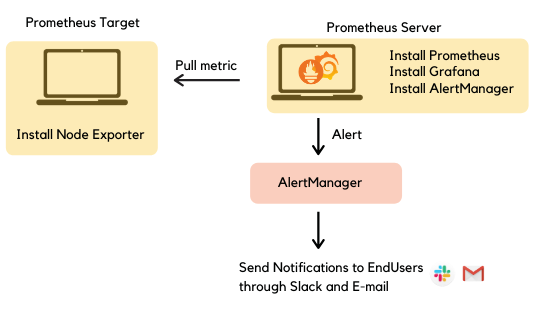

## Architecture

  

## Directory 

|File | Location |
|---|---|
| alert_rules.yml | /etc/prometheus/alert_rules.yml |
| prometheus.yml | /etc/prometheus/prometheus.yml |
| alertmanager.yml | /etc/alertmanager/alertmanager.yml |

## Reference

- [Prometheus Alerting with AlertManager](https://medium.com/devops-dudes/prometheus-alerting-with-alertmanager-e1bbba8e6a8e)

